# Gorm Sharding

[](https://github.com/longbridgeapp/gorm-sharding/actions/workflows/go.yml)
[](https://pkg.go.dev/github.com/longbridgeapp/gorm-sharding)

Gorm Sharding plugin using SQL parser and replace for splits large tables into smaller ones, redirects Query into sharding tables. Give you a high performance database access.

Gorm Sharding 是我们基于 Longbridge 的业务场景以及我们的实践经验构建出来的一个高性能的数据库分表中间件。

它基于 Conn 层做 SQL 拦截、AST 解析、分表路由、自增主键填充，带来的额外开销极小。对开发者友好、透明，使用上与普通 SQL、Gorm 查询无差别，只需要额外注意一下分表键条件。

## Features

- Non-intrusive design. Load the plugin, specify the config, and all done.
- Lighting-fast. No network based middlewares, as fast as Go.
- Multiple database support. PostgreSQL tested, MySQL and SQLite is coming.
- Allows you custom the Primary Key generator (Sequence, UUID, Snowflake ...).

## Sharding process

This graph show up how Gorm Sharding works.



## Install

```bash
go get -u github.com/longbridgeapp/gorm-sharding
```

## Usage

Open a db session.

```go
dsn := "postgres://localhost:5432/sharding-db?sslmode=disable"
db, err := gorm.Open(postgres.New(postgres.Config{DSN: dsn}))
```

Config the sharding middleware, register the tables which you want to shard. See [Godoc](https://pkg.go.dev/github.com/longbridge/gorm-sharding) for config details.

```go
middleware := sharding.Register(map[string]sharding.Resolver{
    "orders": {
        ShardingColumn: "user_id",
        ShardingAlgorithm: func(value interface{}) (suffix string, err error) {
            if uid, ok := value.(int64); ok {
                return fmt.Sprintf("_%02d", uid%4), nil
            }
            return "", errors.New("invalid user_id")
        },
        PrimaryKeyGenerate: func(tableIdx int64) int64 {
            return node.Generate()
        },
    },
})
```

Use the middleware for db session.

```go
db.Use(&middleware)
```

Use the db session as usual. Just note that the query should have the sharding field when operate sharding tables.

```go
// this record will insert to orders_02
db.Create(&Order{UserID: 2})

// this record will insert to orders_03
db.Exec("INSERT INTO orders(user_id) VALUES(?)", int64(3))

// this will throw ErrMissingShardingKey error
err = db.Exec("INSERT INTO orders(product_id) VALUES(1)").Error
fmt.Println(err)

// this will redirect query to orders_02
var orders []Order
db.Model(&Order{}).Where("user_id", int64(2)).Find(&orders)
fmt.Printf("%#v\n", orders)

// this will throw ErrMissingShardingKey error
err = db.Model(&Order{}).Where("product_id", "1").Find(&orders).Error
fmt.Println(err)

// Update and Delete are similar to create and query
db.Exec("UPDATE orders SET product_id = ? WHERE user_id = ?", 2, int64(3))
err = db.Exec("DELETE FROM orders WHERE product_id = 3").Error
fmt.Println(err) // ErrMissingShardingKey
```

The full example is [here](./examples/order.go).

## License

This project under MIT license.
