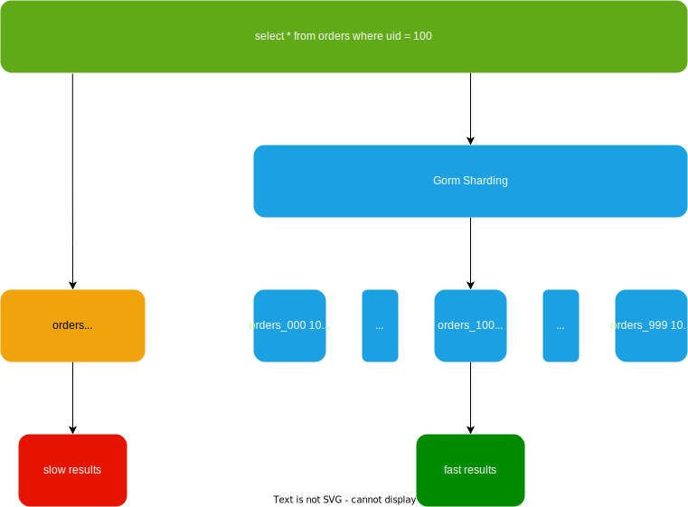

# Gorm Sharding

[English](./README.md) | 简体中文

Gorm Sharding 是一个业务污染小，高性能的数据库分表方案。通过 SQL 解析和替换，实现分表逻辑，让查询正确的根据规则执行到分表里面。



## 特色

- 非侵入式设计，业务污染极小。
- 基于 Gorm Plugin 设计，无中间件服务，基本无额外的性能开销。
- 多种数据库支持：PostgreSQL 已测试，MySQL 和 SQLite 进行中。
- 配置简单易懂。
- 支持自定义主键生成方式。

## 安装

```bash
go get -u github.com/longbridgeapp/gorm-sharding
```

## 用法

数据库连接打开后，使用分表插件注册需要拆分的表。

`Register` 函数接收一个 map，键是**原始表名**，值是一个 **resolver** ，由可配置的字段组成。

具体配置信息见 [Godoc](https://pkg.go.dev/github.com/longbridge/gorm-sharding)。

## 用法示例

```go
middleware := sharding.Register(map[string]sharding.Resolver{
	"orders": {
		ShardingColumn: "user_id",
		ShardingAlgorithm: func(value interface{}) (suffix string, err error) {
			switch user_id := value.(type) {
			case int64:
				return fmt.Sprintf("_%02d", user_id % 64), nil
			default:
				return "", errors.New("invalid user_id")
			}
		},
		PrimaryKeyGenerate: func(tableIdx int64) int64 {
			return keygen.Next(tableIdx)
		}
	},
})
db.Use(middleware)
```

## 许可证

本项目使用 MIT 许可证。
