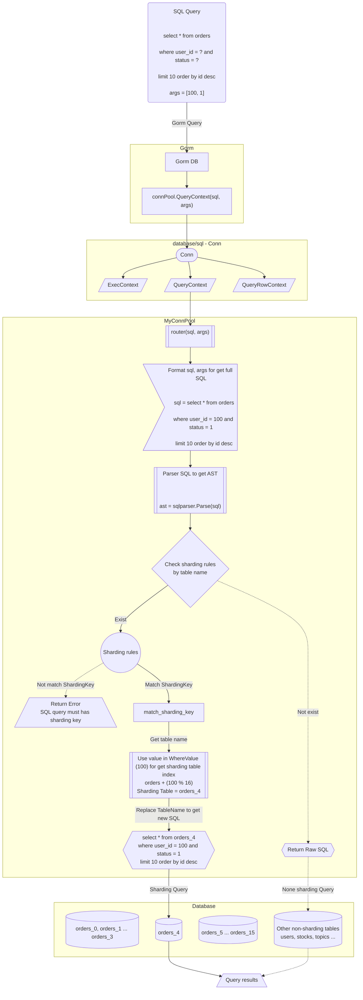

Use https://mermaid.live for generate SVG.

```mermaid
graph TD
first("SQL Query<br><br>
select * from orders<br>
where user_id = ? and status = ?<br>
limit 10 order by id desc<br>
args = [100, 1]")

first--->| Gorm Query |db["Gorm DB"]

subgraph "Gorm"
  db-->gorm_query
  gorm_query["connPool.QueryContext(sql, args)<br>"]
end

subgraph "database/sql - Conn"
  ExecContext[/"ExecContext"/]
  QueryContext[/"QueryContext"/]
  QueryRowContext[/"QueryRowContext"/]
  gorm_query-->Conn
  Conn(["Conn"])
  Conn-->ExecContext
  Conn-->QueryContext
  Conn-->QueryRowContext
end

subgraph sharding ["MyConnPool"]
  QueryContext-->router-->format_sql-->parse-->check_table
  router[["router(sql, args)<br><br>"]]
  format_sql>"Format sql, args for get full SQL<br><br>
    sql = select * from orders<br>
    where user_id = 100 and status = 1<br>
    limit 10 order by id desc"]

  check_table{"Check sharding rules<br>by table name"}
  check_table-->| Exist |process_ast
  check_table_1{{"Return Raw SQL"}}
  not_match_error[/"Return Error<br>SQL query must has sharding key"\]

  parse[["Parser SQL to get AST<br>
  <br>
  ast = sqlparser.Parse(sql)"]]

  check_table-.->| Not exist |check_table_1
  process_ast(("Sharding rules"))
  get_new_table_name[["Use value in WhereValue (100) for get sharding table index<br>orders + (100 % 16)<br>Sharding Table = orders_4"]]
  new_sql{{"select * from orders_4<br>where user_id = 100 and status = 1<br>limit 10 order by id desc"}}

  process_ast-.->| Not match ShardingKey |not_match_error
  process_ast-->| Match ShardingKey |match_sharding_key-->| Get table name |get_new_table_name-->| Replace TableName to get new SQL |new_sql
end


subgraph database [Database]
  orders_other[("orders_0, orders_1 ... orders_3")]
  orders_4[(orders_4)]
  orders_last[("orders_5 ... orders_15")]
  other_tables[(Other non-sharding tables<br>users, stocks, topics ...)]

  new_sql-->| Sharding Query | orders_4
  check_table_1-.->| None sharding Query |other_tables
end

orders_4-->result
other_tables-.->result
result[/Query results\]
```
